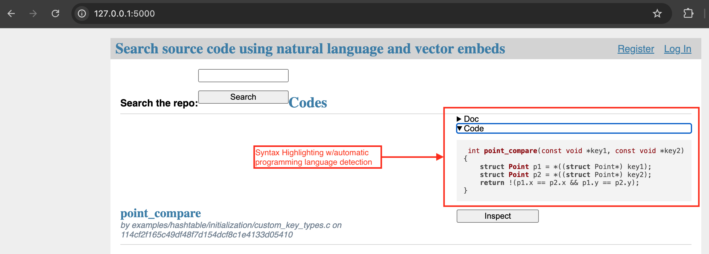
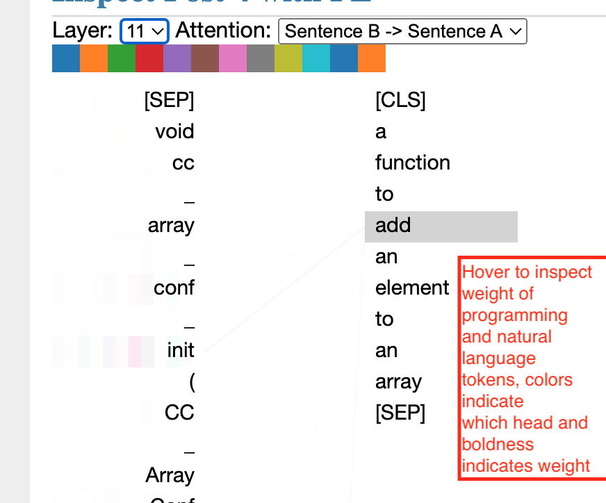

# Prereqs

## vector db extension install for flask app

Follow instructions to build vector extension [here](https://docs.google.com/document/d/1qtNtxuK96Fha1l3QYFvkM-4-K05ganpsy4wd-UfaY9g/edit?tab=t.0)

Will be added here to readme directly.

Tested on Mac OS (both M1 and b6x64), with Python 3.11.

## make venv

```bash
python3 -m venv .
. bin/activate
python3 -m pip install -r requirements.txt
```

## initialize the db

Update paths in vec_search/config.py file for DATABASE and for _SQLITE_VEC_DLL_PATH variables with your local paths.

```bash
flask --app vec_search init-db
```
Note that the above command populates the sqlite db with the vectors
from the given file (currently, the Collections-java.jsonl file is used as example, as noted in vec_search/config.py).

## to run the app on localhost

```bash
flask --app vec_search run --debug
```

For the vectors we read these from a file at application startup time.
This allows for the vectors to be embedded from somewhere else. e.g.
any application-and any vector embedding method.

## execute a semantic search

You may have noticed the search form on the top of the listing page.
If you enter a natural language description like ``a function to add an element to an array`` you'll see something like

```bash
"GET /?q=a+function+to+add+an+element+to+an+array HTTP/1.1" 200
```

in the stdout for the terminal where the flask app is running.

# execute searches locally

If you execute searches locally you probably want to include your own
index and not the current sampled jsonl file that contains only a few records.
We provide the sampled jsonl file to keep the size of the repo small whilst
maintaining a useable prototype.

# Inspect the SERPs

A search engine results page (SERP) shows the results from a natural
language query, in a format that is useful for the human.
For semantic search we use cosine distance between the query embedding
and the embedded entities in the example jsonl file. These entities
are programming languages and associated documentation.

The embedding model for the query and the code provided is the CodeBERT
model from Microsoft. The goal is to keep the model size small while still
working end to end. The code model is configurable via changes to the
 `config.py` module's `AI_MODEL` entry.

However, if you use a different model it is recommended to re-embed the code
entities to maintain proper alignment of vector spaces between query embeddings
and entity embeddings.

Typical inspection workflow:


Here you find the listings of all entries in your jsonl file
in an arbitrary order because no search has been performed.

Next use the search bar to enter a natural language search query.


Here you will find the entities from your search
in semantic distance, closest is first and then proceeds
in ascending order.


After clicking the inspect button you will be taken to a
detail page where the dropdown menus provide a configurable
view of the attention weights from the semantic code search.
Hovering the mouse over code tokens or words enables inspection
of particular terms in the query or the code.

After sensemaking the human may want to iteratively modify
their natural language query using the 3 part workflow above.

Note: the model weights need at least 16GB RAM and a reasonable amount of disk space.

# Relevance Annotation

## Human workflow
The intent of this workflow is to enable a user to generate a benchmark (AKA
golden dataset) from their code-query corpus.

Purpose:
The annotation workflow, and subsequently generated benchmark data are
useful for comparing a base model-say from huggingface-versus a fine tuned
model for the users needs or comparing two distinct models which are not fine
tuned.

Steps:
1. Create-if necessary-and login as a user
2. Execute a query
3. The results of the query for the given corpus are shown in the SERP
4. Select relevance annotations for each result, clicking done once you
are sure of your relevance determination
5. Repeat steps 1-4 for each query

Notes:

The queries and query relevances are stored in tables
`queries` and `query_relevances` in the sqlite db.
Once the human has completed the annotations these may be exported from
the sqlite db for further processing.

The sqlite db file is located in the `var/vec_search-instance/` directory or more generally in the path specified in the `config.py` module for the application.

To collect the data for the annotations:

```bash
flask --app vec_search export-rad-to-csv rad.csv
```
Note that this exports to a file in the current working directory named
`rad.csv`. If you want a different filename this provide the alternate filename.
If the file already exists in the working directory then an overwrite will occur.I

## Manual workflow to generate relevance data

The click command is similar to this workflow:
```bash
# opens a REPL environment for sqlite3, if you modify the config.py then change the path
sqlite3  var/vec_search-instance/vec_search.sqlite

# make the field names displayed in results of queries and a comma separator
.mode column
.mode csv
# output results to csv file
.output relevance_annotation_details.csv

# annotation results
# we concatenate duplicates in a comma sep list (post_id, query_id, user_id)

SELECT
qr.query_id,
qr.post_id,
q.user_id,
GROUP_CONCAT(qr.relevance) AS relevances,
qr.rank,
qr.distance,
q.query
FROM query_relevances AS qr
INNER JOIN (
  SELECT query_id, query, user_id FROM queries
) AS q ON qr.query_id = q.query_id
GROUP BY
q.query_id,
user_id,
post_id
;

# exit sqlite REPL env
.quit
```

The file `relevance_annotation_details.csv` should contain the results of the above query.
This file is placed in the directory where you initiated the sqlite3 command.

For debugging purposes it is sometimes helpful
to see the schema for all tables in the REPL environment:

```bash
SELECT * FROM sqlite_master WHERE type='table';
```

# LLM annotation workflow (WIP-work in progress)

A backend/batch workflow where relevances are assessed outside of a human workflow
is the behavior currently supported. Assuming in the previous step you wrote the human generated
annotations to the file `rad.csv` and there is *no* file in the current working directory named
`llm_gen_rel.csv` then run:

```bash
flask --app vec_search gen-llm-rels rad.csv llm_gen_rel.csv
```
and you will find the generated llm relevances in the csv file along with the data from `rad.csv`
and other llm client metadata, like e.g. token usage, etc.

In general the argments for `gen-llm-rels` command look like:

```bash
flask --app vec_search gen-llm-rels <input-csv> <output-csv> <llm-model-name> <dup-strategy>
```

The defaults for the last 2 are `'openai'` and `'takelast'`.

Also supported for `llm-model-name` are: `gemini`, more to be added.

There prompt is in the `llm_rel_gen.py` module, we use the umbrella prompt.

Note: if you use the openai llm you need an api key in `OPEN_AI_API_KEY` env var, if you use the gemini model you need the `GCP_PROJECT_ID` env var
set to a project which has the necessary privileges and you need to modify the bucket names for your project.


For TODOs cf. [this open issue](https://github.com/rlucas7/code-searcher/issues/10)

# Metrics generation
To generate IR metrics for the data once placed into pandas df(s).

In this step we summarize the binary relevance metrics via some standard summary
statistics, e.g. Cohen Kappa, Spearman rank correlation, Kendall Tau, Map@k, and
Rank Biased Overlap-RBO@k. For all metrics the chosen `k` value is given in the
flask config for the app. Summary statistics are piped to standard out and not
persisted unless done manually by the invoker.

The command to invoke is:

```bash
flask --app vec_search gen-ir-metrics <csv-filename>
```
so if you used the default `llm_gen_rel.csv` in the previous cmd, then you'd
execute the following:

```bash
flask --app vec_search gen-ir-metrics llm_gen_rel.csv
```
and you'll see the metrics and after first seeing the raw dataframe in stdout.
